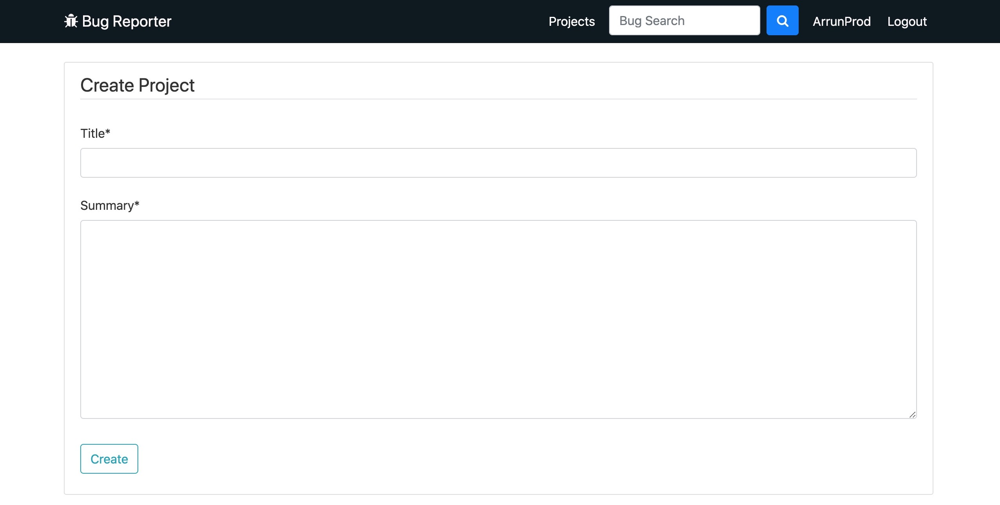
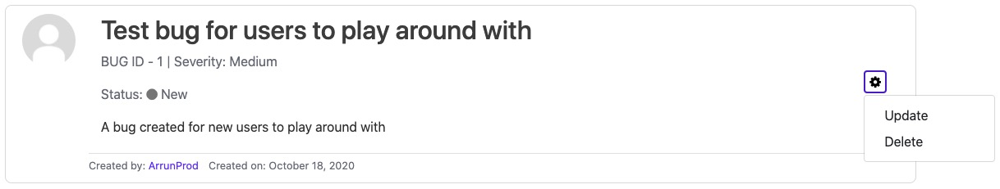

## Bug Reporter Application

**Link:** [bugreporterapp.herokuapp.com](https://bugreporterapp.herokuapp.com/)

Please feel free to create your own account or use the sample account below to log in!  
**Username:** Test_User  
**Password:** Testing321  

The Bug Reporter application is a project I have built to help users and their teams have a place to keep track of the bugs and tasks that need to be completed for their projects. It was built using Django and PostgreSQL and deployed to Heroku using AWS S3 for image hosting. Happy project building and I hope the Bug Reporter application can help you keep track of the bugs you come across while building your projects!

<h3>1. Projects</h3>

Once logged in, the main page of the application shows you what projects users are working on.

<h4>1.1 Adding a new project</h4>

Click on the 'Add New Project' button to add a new project that you would like to track your bug and tasks for as you work on it.

The only fields required are the title of your project and a quick summary to help distinguish what the project is about:

Once these fields have been filled click 'Create.'

Once you've created your project and are redirected to the 'Projects' screen, click on the title of the project to be directed to where to log bugs and tasks for the project. If you wish to update the title or summary of the project or delete the project, you can also do that from this screen:

<h3>2. Bugs</h3>

The bugs screen shows the bugs and tasks that are assigned under each project.

<h4>2.1 Adding a new bug</h4>

Click on the 'Add New Bug' button to add a new bug or task that needs to be tracked for your project.

<h6>Title and Type</h6>

Add a title to your bug and choose what type of bug it is (if it is an issue produced by the project, it can be given the type 'Bug.' If it is an enhancement or a new addition to the project, it can be given the type 'Task').

<h6>Status</h6>

Set the status of the bug (most bugs will be given the status of 'New' but as the bug progresses this status will change):

<ul>
<li>New: A bug that is just been logged</li>
<li>Active: A bug that is being worked on to solve</li>
<li>On Hold: A bug that cannot be handled at the moment or will be taken care of in the future</li>
<li>Resolved: A bug that has been fixed and can be retested</li>
<li>Closed: A bug that has been solved, tested and is no longer an issue</li>
</ul>

<h6>Severity</h6>

Choose the severity of the bug (High meaning the bug is urgent and needs to be fixed ASAP while low means the issue is not very important and can be taken care of when possible).

<h6>Summary</h6>

Finally the bug needs a bug summary, to give those who see it an idea of what the issue is.

Once these details are added in, click 'Create' to log the bug.

On the screen for the project, the bugs and tasks that have been logged will be listed out in small blurbs. Each bug will have its title, bug number, severity, status and summary outlined. These details that have been entered for the bug can be updated or deleted by clicking on the cog:

<h4>2.2 Maintaining a bug</h4>

By clicking on the bug title on the project's home screen, it will open up the bug and allow users to update the bug as its being worked on. This includes changing any of the fields that were added when first creating the bug (ex. updating the title or the status by clicking update ing the cog) but also adding comments, to let those who open the bug have more details on how the progress of the bug is going:

<h3>3. Search</h3>

<h3>4. Profile</h3>